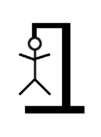

<div id="top"></div>

<!-- BRANCH TITLE -->

# Branch 3: DOM

- [Intro](https://github.dev/manighahrmani/hangman-in-branches)
- [0: Variables](https://github.com/portsoc/hangman-in-branches/tree/0)
- [1: Functions](https://github.com/portsoc/hangman-in-branches/tree/1)
- [2: NPM](https://github.com/portsoc/hangman-in-branches/tree/2)
- 3: DOM(current branch)
- [4: Events](https://github.com/portsoc/hangman-in-branches/tree/4)
- [5: Debugging](https://github.com/portsoc/hangman-in-branches/tree/5)
- [6: Canvas](https://github.com/portsoc/hangman-in-branches/tree/6)
- [7: Modularisation](https://github.com/portsoc/hangman-in-branches/tree/7)
- [8: Server Part 1](https://github.com/portsoc/hangman-in-branches/tree/8)
- [9: Server Part 2](https://github.com/portsoc/hangman-in-branches/tree/9)
- [10: Style](https://github.com/portsoc/hangman-in-branches/tree/10)
- [11: Linting](https://github.com/portsoc/hangman-in-branches/tree/11)
- [12: Database](https://github.com/portsoc/hangman-in-branches/tree/12)
- [13: SVG](https://github.com/portsoc/hangman-in-branches/tree/13)

## Objectives

Our website needs a homepage.
So our main task here is to create a simple HTML page.

All we care about at this stage is to have placeholders for different components of our game.
Therefore we don't care about the style of the page (no CSS!).

We also require our JS script (previously called `hangman.js`) to be linked to the HTML document.
Ideally, we would like the script to perform some forms of basic DOM manipulation too.

Before you start, make sure to check out the moodle resources, especially:
Try the examples in [Code Examples to Copy, stage 5](https://portsoc.github.io/code-copy-examples/stage-5) and attempt the tests in the [dom101 repository](https://github.com/portsoc/dom101).

## Implementation

### HTML

We have created a simple HTML page titled `index.html`.

`index.html` begins with defining standard metadata for the page, such as the title, character set, and viewport.
But the important parts of this document are the sections that we have defined:

```html
<section id="noose">
  
</section>
<section id="instruct">This text should be replaced by the JavaScript.</section>
<section id="feedback">Take a guess!</section>
<section id="keyboard"></section>
```

Here are what we are going to do with each of these sections:

- `#noose`: The image/canvas of the hangman. At the moment, it contains a placeholder image.
- `#instruct`: It currently contains a row of dashes representing letters to be guessed.
- `#feedback`: Hints and messages to the player.
- `#keyboard`: An on-screen keyboard.

Additionally, we have renamed `hangman.js` to `index.js` (a more conventional name).
In Visual Studio Code, you can rename files by right-clicking on them and selecting `Rename` from the context menu.

Finally, we have linked our JavaScript file to the HTML document with a `<script>` tag:

```html
<script src="index.js"></script>
```

### DOM Manipulation

We have defined the following functions in our script:

- `drawKeyboard`: Creates a set of buttons for the on-screen keyboard.
- `startNewGame`: Takes a random word, replaces all the letters with '_' and displays it in the instruct section.

But when should we call these functions?
We can call them when the page loads.

Take a look at our `init` function that is called once the window has loaded.
`init` in turn calls `drawKeyboard` and `startNewGame`.
The reason for this practice is to make sure that no DOM manipulation is done before the page has loaded.

To see our new changes, [visit this compare page](https://github.com/portsoc/hangman-in-branches/compare/2...3?diff=split) showing the difference between branches 2 and 3.

## Usage

Open `index.html` in your browser (<kbd>Ctrl</kbd> + <kbd>O</kbd> in Linux/Windows or <kbd>Cmd</kbd> + <kbd>O</kbd> in Mac).

The script should be already running.
Do you see the keyboard or the dashes for the hangman word?

## Further Exploration

Console log the value of `word` before the closing brackets of the `startNewGame` function in `index.js`.
Afterward, save `index.js` and refresh the page in your browser.

Now, inspect the page with <kbd>F12</kbd> or by right-clicking on the page and selecting "Inspect".

You should see the value of `word` in the console.
If you cannot see the console try to:

- (a) Click on the "Console" drawer in the bottom panel.
- (b) Navigate to the "Console" tab on top.


It is a good habit to log the value of variables while you are developing a project.
We will come back to this when we learn about debugging.

<p align="right">(<a href="#top">back to top</a>)</p>
